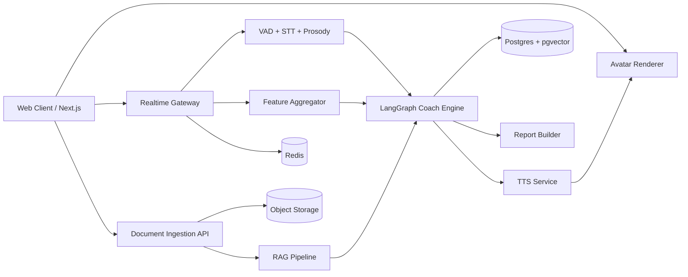
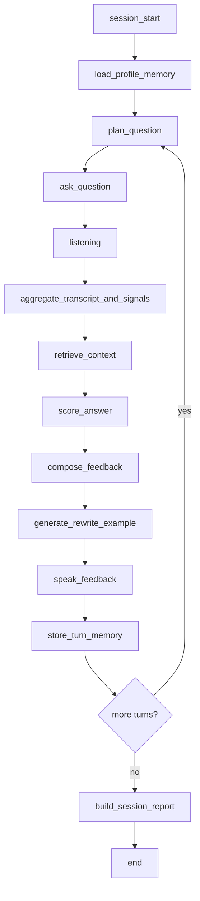

# Real-time Multimodal AI Coach Avatar
## 3주 팀프로젝트용 전체 설계안 (POC → MVP → 확장)

작성 목적:  
실시간 면접/발표 코칭 웹앱을 **3주 안에 구현 가능한 수준으로 설계**하고,  
이후 모바일앱/고품질 아바타/더 정교한 개인화로 확장할 수 있도록  
**파이프라인, 모델 선정, POC/MVP 범위, 데이터/RAG, DB, UI/UX, API, LangGraph 구조**를 한 번에 정리한 문서입니다.

---

## 0. 핵심 결론

이 프로젝트는 **“완전 실시간 디지털 휴먼”**으로 접근하면 3주 안에 무너지기 쉽습니다.  
반대로 **“turn-based realtime coach”**로 설계하면 충분히 구현 가능합니다.

가장 현실적인 방향은 아래입니다.

1. **브라우저에서 MediaPipe로 얼굴/자세 feature를 추출**하고, 서버에는 원본 영상 대신 feature만 보냅니다.
2. 오디오는 **VAD → chunk → STT(partial transcript)** 흐름으로 처리합니다.
3. 답변 단위가 끝날 때마다 **LangGraph 기반 코칭 그래프**가  
   질문 맥락 + 문서 RAG + 세션 memory + 시각/음성 지표를 합쳐 피드백을 만듭니다.
4. 피드백은 **TTS + Web 3D VRM 아바타**로 출력합니다.
5. 저장소는 **Postgres + pgvector + Redis + Object Storage** 조합으로 갑니다.
6. 앱은 **웹앱으로 먼저 만들고**, 이후 **PWA → Capacitor 래핑**으로 모바일 확장합니다.

즉, **웹 우선 / local feature extraction / turn-based realtime / lightweight avatar / memory-driven personalization**이 3주 프로젝트에 가장 맞는 구조입니다.

---

## 1. 프로젝트 목표 수준 정의

### 1-1. POC (Week 1 종료 시점)
POC는 “핵심 파이프라인이 끝에서 끝까지 연결되는가”만 증명하면 됩니다.

반드시 되는 것:
- 카메라/마이크 권한 획득
- 브라우저에서 얼굴/자세 feature 추출
- 오디오 chunk 업로드 및 STT
- 문서 1개 업로드 후 검색 1회
- 답변 종료 후 텍스트 피드백 생성
- 아바타가 음성으로 1회 피드백 전달

아직 안 해도 되는 것:
- 정교한 점수 리포트
- 멀티턴 memory 품질 고도화
- follow-up 질문 자동 생성
- 고급 립싱크
- 모바일 최적화

### 1-2. MVP (Week 3 데모 기준)
MVP는 “사용자가 실제로 한 세션을 돌려보고, 다음 세션에 개인화가 반영되는가”를 보여줘야 합니다.

반드시 되는 것:
- 이력서/발표자료 업로드
- 면접/발표 모드 선택
- 질문 2~3턴 진행
- partial transcript 및 실시간 기본 지표
- turn 종료 후 근거 있는 피드백
- TTS 아바타 피드백
- 세션 종료 리포트
- 이전 피드백 반영한 다음 턴 또는 다음 세션 personal memory

### 1-3. Stretch (MVP 이후)
- follow-up 질문 자동 난이도 조절
- 음성 억양/강세/에너지 코칭 고도화
- voice clone
- 팀 관리자 대시보드
- 모바일 native wrapper
- 고급 viseme / gesture / emotion cue
- multi-user room / mock interviewer mode

---

## 2. 전체 파이프라인 권장 방식



### 2-1. 브라우저 레이어
브라우저는 단순 입력 UI가 아니라 **실시간 feature extraction client** 역할을 합니다.

담당 기능:
- webcam / mic permission
- MediaPipe face / pose 추출
- audio capture
- feature frame throttling
- transcript / metric dashboard
- VRM avatar rendering
- TTS audio playback
- user controls / privacy toggles

### 2-2. Realtime Gateway
Backend 첫 레이어는 “세션 이벤트를 순서대로 받아 처리하는 게이트웨이”가 좋습니다.

역할:
- WebSocket 연결 관리
- session_id / turn_id 생성
- audio chunk 수신
- feature frame 수신
- partial transcript 전달
- metric update 브로드캐스트
- AI graph 호출 타이밍 제어
- event ordering / retry / latency logging

### 2-3. 분석 파이프라인
입력 분석은 두 갈래로 나눕니다.

#### A. Audio branch
- VAD로 발화 구간 분리
- chunk 단위 STT
- partial transcript 누적
- filler word / pause / speech rate 계산
- prosody feature 추출 (pitch, energy, intensity variation)

#### B. Vision branch
- eye/contact proxy
- head yaw/pitch stability
- posture stability
- shoulder symmetry
- speaking-frame presence
- 표정 cue용 blendshape 계수

### 2-4. AI 코칭 엔진
AI는 한 번에 다 하지 말고 **역할 분리된 그래프**로 둡니다.

권장 모듈:
- scenario planner
- retriever
- answer scorer
- feedback composer
- rewrite/example generator
- memory writer
- report summarizer
- guardrail checker

### 2-5. 출력 레이어
출력은 **오디오 / 아바타 / 리포트** 세 개로 분리합니다.

- 짧은 구두 피드백: 아바타 TTS
- 실시간 대시보드: text + gauges
- 세션 종료 후: rich report

---

## 3. 3주 프로젝트에 맞는 권장 기술 스택

## 3-1. 전체 스택 요약

| 영역 | 권장 선택 | 비고 |
|---|---|---|
| Frontend | Next.js(App Router), TypeScript, React, Tailwind, shadcn/ui | 웹 우선 |
| Realtime | FastAPI + WebSocket | 3주 MVP에서 가장 단순 |
| Session Cache | Redis | 세션 상태/큐/락 |
| Main DB | PostgreSQL | 정형 데이터 저장 |
| Vector | pgvector | Postgres와 일원화 |
| Object Storage | S3 compatible storage | 원본 문서/옵션 녹음 저장 |
| Vision | MediaPipe Face/Pose | 브라우저 실행 |
| STT | faster-whisper + Whisper | 오픈소스 기반 |
| VAD | Silero VAD | segment 분할 |
| Prosody | openSMILE + librosa | pitch / energy / tempo |
| LLM | Qwen3-8B | 기본 추천 |
| Embedding | BGE-M3 | 다국어 + 긴 문서 |
| Reranker | BGE-reranker-v2-m3 | top-k 재정렬 |
| TTS | MeloTTS | 한국어 포함 |
| Avatar | VRM + three-vrm + React Three Fiber | 웹 친화 |
| Orchestration | LangGraph | 멀티턴 / memory / 분기 |
| Observability | OpenTelemetry + basic logs | 최소 구성 |
| Deployment | Docker Compose → cloud VM | 빠른 배포 |

---

## 4. 무료/오픈소스 모델 추천안

## 4-1. 기본 추천 조합 (가장 현실적)
이 조합이 3주 MVP에 가장 균형이 좋습니다.

| 기능 | 기본 추천 | 이유 |
|---|---|---|
| VAD | Silero VAD | 가볍고 빠름 |
| STT | faster-whisper + whisper-large-v3-turbo | 구현 난이도 대비 품질 좋음 |
| LLM | Qwen3-8B | 멀티턴/도구사용/다국어/오픈 라이선스 측면 균형 |
| Embedding | BGE-M3 | 한국어 포함 다국어, 긴 문서, dense/sparse/multi-vector 성격 |
| Reranker | BGE-reranker-v2-m3 | retrieval 품질 보정 |
| TTS | MeloTTS | 한국어 지원, 로컬 구동 쉬움 |
| Voice Clone (옵션) | XTTS-v2 | 음성 복제/스트리밍은 가능하지만 MVP 기본값으로는 과함 |

## 4-2. LLM 선택 기준
### 추천 1: Qwen3-8B
가장 무난한 기본값입니다.

적합한 이유:
- tool use / agent 구성과 잘 맞음
- 멀티턴 대화 품질이 좋음
- 한국어/영어 혼합 자료에서도 안정적
- 8B급이라 로컬/서버 배포 현실적
- non-thinking / thinking 모드 분리 가능

추천 용도:
- 질문 생성
- 답변 평가
- 피드백 생성
- 세션 요약
- memory write decision

### 추천 2: Qwen3-4B 또는 소형 대안
GPU 여유가 적으면 소형 모델로 낮춥니다.

적합한 상황:
- 동시성보다 데모 안정성이 중요할 때
- 리포트보다 realtime turn speed가 더 중요할 때
- 팀 인프라가 제한적일 때

### 추천 3: EXAONE 3.5 7.8B (비상업/연구 중심 옵션)
한국어 감각은 좋을 수 있으나, **라이선스가 NC**라서  
포트폴리오/연구 데모에는 가능해도 이후 제품화까지 생각하면 기본 선택으로 두기 어렵습니다.

### 추천 4: 한국어 특화 파인튜닝 모델
후보:
- KULLM3
- 기타 한국어 instruct 모델

권장 방식:
- 1차 MVP는 Qwen3-8B
- 2차 A/B test에서 한국어 특화 모델 비교

---

## 5. STT / TTS / Prosody / Avatar 세부 권장안

## 5-1. STT
### 기본
- faster-whisper backend
- whisper-large-v3-turbo model
- partial transcript는 audio chunk 단위 누적

### 운영 팁
- 20~40ms 단위 raw frame 수집
- 0.5~1.5초 chunk화
- VAD 기준 speech segment 종료 시 확정 transcript 생성
- partial text는 UI에 회색으로 먼저 표시
- final text는 확정 색상으로 교체

### 점수 계산에 직접 쓰는 feature
- WPM / CPS
- 평균 pause 길이
- longest silence
- filler word count
- 문장 길이 분산
- 답변 총 길이
- 질문 대비 핵심 키워드 커버리지

## 5-2. TTS
### 기본
- MeloTTS
- 여성/남성 1개씩 voice preset
- 짧은 피드백 1~3문장 길이

### 옵션
- XTTS-v2로 voice cloning
- 단, speaker consent / 라이선스 / latency 부담 고려

## 5-3. Prosody
모델보다 feature extractor 기반이 3주엔 유리합니다.

추천 feature:
- mean pitch
- pitch range
- energy mean/std
- speaking intensity
- sentence-end fall/rise
- monotony score
- articulation rhythm proxy
- voiced / unvoiced ratio

실전 코칭에선 “감정 진단” 대신 아래처럼 바꿔야 합니다.
- 나쁨: “감정이 불안해 보여요”
- 좋음: “문장 끝 억양이 계속 평평해서 핵심이 덜 살아납니다”

## 5-4. Avatar
### 기본 전략
웹에선 **VRM 아바타 + 기본 idle + blink + mouth open**만으로도 충분합니다.

MVP에서 추천하는 단계별 구현:
1. TTS 재생 중 mouthOpen / jawOpen을 audio amplitude 기반으로 움직임
2. blink / nod / idle animation 추가
3. sentence sentiment가 아니라 **feedback type**에 따라 표정 cue 분기
   - praise
   - caution
   - example
   - follow-up
4. 고급 viseme은 stretch goal

### 왜 이 방식이 맞는가
정교한 phoneme-to-viseme alignment는 품질은 좋아도 개발 시간이 큽니다.  
3주 프로젝트에서는 **“립싱크처럼 보이는 정도”**가 중요합니다.

---

## 6. LangGraph 설계

## 6-1. 왜 LangGraph가 잘 맞는가
이 프로젝트는 단순 chatbot이 아니라:
- 질문 생성
- 실시간 입력 수집
- turn 종료 감지
- 답변 평가
- retrieval
- memory update
- report build

처럼 **상태가 있는 여러 단계를 순서대로 흐르게 해야 하므로** LangGraph가 잘 맞습니다.

## 6-2. 권장 Graph 구조



## 6-3. State 설계 예시

```ts
type CoachGraphState = {
  sessionId: string;
  userId: string;
  mode: "interview" | "presentation";
  personaId?: string;
  currentTurn: number;

  uploadedDocIds: string[];
  retrievedChunkIds: string[];

  transcriptPartial: string;
  transcriptFinal: string;

  audioMetrics: {
    wpm?: number;
    fillerCount?: number;
    avgPauseMs?: number;
    longestPauseMs?: number;
    pitchRange?: number;
    energyVar?: number;
  };

  visionMetrics: {
    eyeContactScore?: number;
    headStability?: number;
    postureStability?: number;
    facePresence?: number;
  };

  rubricScores: {
    structure?: number;
    specificity?: number;
    relevance?: number;
    delivery?: number;
    confidenceProxy?: number;
  };

  memoryContext: string[];
  feedbackText?: string;
  rewriteExample?: string;
  reportId?: string;
};
```

## 6-4. Memory 정책
개인 맞춤형에서 memory는 무조건 들어가야 하지만,  
**무분별 저장**은 오히려 독이 됩니다.

### 저장할 것
- 사용 목표 직무/발표 주제
- 자주 부족한 항목
- 사용자가 “도움됨”으로 누른 피드백
- 반복적으로 나타나는 약점
- 선호 톤/난이도/연습 모드
- 자주 쓰는 경험 사례, 프로젝트 키워드

### 저장하지 말 것
- 원본 raw audio/video
- 추측 기반 감정 판단
- 일회성 잡음
- confidence 낮은 시각 판단
- 사용자가 거절한 피드백

### 권장 구조
- **thread memory**: 현재 세션 최근 turn
- **episodic memory**: 지난 세션 요약/약점/개선 이력
- **semantic memory**: 유저 선호/직무/자주 쓰는 근거 문장

---

## 7. RAG 데이터 / DB 참고 데이터 수집 전략

## 7-1. 가장 중요한 원칙
이 프로젝트의 RAG는 “대규모 외부 지식 검색”보다  
**사용자 맞춤형 코칭 근거 검색**이 핵심입니다.

즉, 먼저 모아야 할 건 웹 크롤링 데이터가 아니라 아래 4종입니다.

1. 사용자 문서
2. 내부 코칭 기준서
3. 과거 세션 산출물
4. 질문/모범답변/루브릭 사전

## 7-2. RAG에 넣을 데이터 종류

### A. 사용자 업로드 데이터
- 이력서
- 자기소개서
- 포트폴리오
- 경력기술서
- 발표자료(PDF/PPT 변환 text)
- 면접 공고 / JD
- 회사 소개 자료
- 발표 주제 개요
- 예상 질문 리스트

### B. 시스템 레퍼런스 데이터
- 면접 루브릭
- 발표 루브릭
- STAR / PREP / 두괄식 템플릿
- 직무 역량 사전
- 발표 설득 구조 예시
- 회사별 핵심가치 예시 템플릿
- filler word 사전
- 고빈도 follow-up 질문 템플릿
- 좋은 답변 예시 / 나쁜 답변 예시

### C. 세션 생성 데이터
- turn transcript
- audio / vision summary feature
- AI feedback
- user feedback vote(도움됨/별로)
- accepted rewrite
- session summary
- weakness trend

### D. 운영/분석 데이터
- latency log
- model version
- prompt version
- cost / time / failure log
- retrieval hit / miss

---

## 8. RAG ingestion 방식

## 8-1. 문서별 chunking 규칙
문서 종류별로 chunking을 다르게 해야 retrieval이 좋아집니다.

### 이력서 / 경력기술서
- 한 회사 경력 블록 단위
- 프로젝트 한 개 단위
- bullet 묶음 단위
- 200~500 tokens 권장

### 발표자료
- 슬라이드 1장 = 1 chunk
- 발표 노트가 있으면 notes와 slide를 합침
- title / section / slide_no metadata 필수

### JD / 채용공고
- requirement / preferred / role / tech stack 구획별 분리

### 세션 memory
- turn summary 1개 = 1 chunk
- “부족한 점 / 개선 예시 / 다음 turn 목표” 구조로 작게 저장

## 8-2. metadata 설계
각 chunk에는 최소한 아래 metadata가 붙어야 합니다.

- user_id
- source_type
- doc_type
- file_id
- language
- created_at
- topic
- role_target
- company_target
- slide_no / page_no / section
- confidentiality level

## 8-3. retrieval 전략
### MVP 권장
- dense retrieval top 10
- reranker top 3~5
- metadata filter
- final context pack

### Post-MVP
- dense + lexical hybrid
- memory retrieval 분리
- question-type별 retriever 분기
- follow-up retriever

## 8-4. context pack 예시
LLM에 바로 chunk 10개 넣지 말고,  
retrieval 결과를 아래 구조로 정리해서 넣는 게 좋습니다.

```json
{
  "user_profile": ["지원 직무: 백엔드", "강점: 프로젝트 설명 구체성"],
  "target_role_context": ["JD 핵심 역량: 시스템 설계, 협업, 장애 대응"],
  "session_memory": ["이전 답변에서 수치 근거 부족"],
  "supporting_chunks": [
    {"source": "resume", "quote": "대규모 로그 수집 파이프라인 구축"},
    {"source": "portfolio", "quote": "Kafka 기반 이벤트 처리"},
    {"source": "previous_feedback", "quote": "성과 수치를 함께 말할 것"}
  ]
}
```

---

## 9. 추가 데이터 수집 방법 (실전형)

## 9-1. 3주 안에 가장 가치 있는 데이터
공개 데이터보다 **자체 mock session 20~30개**가 더 가치 있습니다.

### 수집 항목
- 질문
- transcript
- audio clip
- feature summary
- human rubric score
- 좋은 피드백 예시
- 안 좋은 피드백 예시
- rewrite example
- user reaction

### 추천 라벨
- structure_score
- specificity_score
- relevance_score
- evidence_score
- delivery_score
- “이 피드백이 실제로 도움되는가” binary/5점

## 9-2. 자체 데이터 수집 프로토콜
1. 팀원/지인 5~10명이 1~2분 답변
2. 면접/발표 각각 2~3문항
3. 사람 평가자 2명이 루브릭 평가
4. disagreement 케이스는 합의
5. raw video는 opt-in
6. transcript와 summary는 익명화 저장

## 9-3. 공개 데이터 사용 포인트
공개 데이터는 **MVP 학습용**보다는 **평가셋 / 템플릿 / 질문유형 참고**로 쓰는 것이 현실적입니다.

권장 사용처:
- 질문 bank seed
- answer 유형 분석
- STT robustness 테스트
- rubric validation
- presentation style examples

---

## 10. DB 구성 권장안

## 10-1. 권장 저장소 구조
### 1) PostgreSQL
정형 데이터의 중심입니다.
- users
- profiles
- sessions
- turns
- feedback
- memories
- reports
- documents metadata

### 2) pgvector
semantic retrieval을 같은 DB 안에서 처리합니다.
- document_chunks.embedding
- memory_items.embedding
- exemplar_answers.embedding

### 3) Redis
실시간 처리용 휘발성 저장소입니다.
- active session state
- websocket presence
- partial transcript buffer
- event queue
- idempotency / lock

### 4) Object Storage
- 업로드 원본 문서
- opt-in audio/video
- generated report artifacts
- avatar asset
- thumbnails

## 10-2. 왜 이 조합이 좋은가
3주 프로젝트에선 저장소를 너무 많이 나누면 운영 복잡도가 폭증합니다.

따라서:
- 정형 + vector = Postgres
- realtime cache = Redis
- file blob = object storage

이 구성이 가장 단순합니다.

## 10-3. 핵심 테이블 추천
- users
- learner_profiles
- uploaded_documents
- document_chunks
- scenario_templates
- session_runs
- session_turns
- realtime_signal_frames(optional sampled)
- turn_signal_summaries
- coach_feedback
- feedback_votes
- memory_items
- report_snapshots
- prompt_versions
- model_versions

## 10-4. 꼭 저장해야 하는 것 vs 안 저장해도 되는 것
### 꼭 저장
- final transcript
- turn summary
- score summary
- feedback text
- retrieval references
- user feedback vote
- memory item
- report snapshot

### 선택 저장
- sampled feature frames
- opt-in raw audio
- debugging traces
- avatar state logs

### 기본 미저장
- raw camera video
- 전체 frame stream

---

## 11. API 설계 권장안

## 11-1. REST API
```txt
POST   /api/auth/guest
GET    /api/profile/me
PUT    /api/profile/me
POST   /api/documents
GET    /api/documents
DELETE /api/documents/:id

POST   /api/sessions
GET    /api/sessions/:id
POST   /api/sessions/:id/end
GET    /api/sessions/:id/report
DELETE /api/sessions/:id

POST   /api/feedback/:id/vote
GET    /api/memories
DELETE /api/memories/:id
```

## 11-2. WebSocket events
### Client → Server
```txt
session.init
audio.chunk
feature.frame
turn.end
feedback.vote
session.end
```

### Server → Client
```txt
session.ready
transcript.partial
transcript.final
metric.update
question.generated
feedback.generated
avatar.speak
report.ready
error
```

## 11-3. 내부 서비스 경계
- realtime-gateway
- ingestion-service
- rag-service
- coach-graph-service
- tts-service
- reporting-service

3주 MVP에서는 이걸 **한 FastAPI repo 안 모듈 분리**로 시작하고,  
배포 후 필요 시 서비스 분리하는 게 낫습니다.

---

## 12. Frontend에 들어갈 기능 아이디어

질문하신 것처럼,  
“입력 = 영상/음성, 출력 = 3D 아바타 피드백”만으로는 제품감이 약합니다.  
아래 기능들을 넣으면 훨씬 살아납니다.

## 12-1. 실시간 연습 화면 기능
### 기본
- live transcript
- mic/camera status
- speaking timer
- pause indicator
- speech rate gauge
- eye contact gauge
- posture gauge
- filler word count
- answer progress bar

### 추천 추가
- “지금 너무 빠름/적정/느림” micro cue
- 답변 구조 가이드(STAR/PREP step progress)
- 핵심근거 사용 여부
- 질문 재확인 카드
- 답변 종료 버튼 / 자동 종료
- “다시 말하기” quick redo

## 12-2. 억양/말투 관련 기능
### 충분히 구현 가능한 것
- 평균 속도
- 문장 끝 억양 단조로움
- pitch range proxy
- energy variation
- 너무 작은/큰 볼륨
- 문장 간 쉼 길이
- filler word density

### stretch이지만 가치 큰 것
- 강조 단어 부족 감지
- monotonous speech warning
- 발표형 vs 대화형 delivery profile
- 질문 유형별 적정 tempo preset

## 12-3. 아바타 외 제품 기능
- practice mode: 면접 / 발표 / 자기소개 / 꼬리질문
- 난이도 선택
- 시간 제한 선택
- role persona 선택(부드러운 면접관, 압박 면접관 등)
- 회사/JD 기반 질문 생성
- 직무 역량 focus mode
- 지난 세션 대비 변화 비교
- 오늘의 집중 과제 3개
- 답변 rewrite example
- 좋은 답변 샘플 보기
- 사용자 피드백 반영(“이 피드백 도움됐어요”)
- 개인정보 삭제
- 녹화 저장 opt-in
- report PDF export (후속)

## 12-4. 관리자/디버그 기능
팀 프로젝트 시연용으로 매우 유용합니다.
- agent trace viewer
- retrieval hit chunks viewer
- latency panel
- prompt version 표시
- model version 표시
- fallback 발생 표시

---

## 13. UI/UX 설계 제안

질문에 첨부한 예시 이미지의 방향은 좋습니다.  
다만 실제 구현은 **“실시간 화면은 단순하게, 사후 화면은 풍부하게”** 가 핵심입니다.

## 13-1. 추천 정보 배치 원칙
### Live 중에는 3가지만 크게
- pace
- eye/posture
- transcript

### 나머지는 접어서 보여주기
- filler count
- detailed rubric
- retrieval references
- trace/log

## 13-2. 화면 구조 제안 (웹 기준)

### A. 홈 / 세션 준비
좌측:
- 연습 목적
- 이력서/자료 업로드
- 회사/JD 첨부
- 난이도/시간 선택

우측:
- 아바타 미리보기
- 오늘 추천 연습 모드
- 지난 세션 요약
- privacy 설정

### B. 실시간 연습 화면
중앙:
- 아바타
- 말풍선/질문 카드
- waveform

하단:
- 녹음 상태
- stop / retry / next

우측 패널(데스크톱):
- partial transcript
- live metric card
- current hint

모바일:
- transcript는 bottom sheet
- metric은 top chips
- report는 별도 화면으로 분리

### C. turn 피드백 오버레이
답변 종료 후 3단 구조로 보여주는 것이 좋습니다.

1. 한 줄 요약  
   예: “구조는 좋지만 성과 수치가 빠졌습니다.”

2. 근거  
   예: “프로젝트 설명은 있었지만 결과 지표가 없었습니다.”

3. 바로 쓸 수 있는 개선 예시  
   예: “응답 시간 30% 감소처럼 수치로 마무리해보세요.”

### D. 세션 리포트 화면
섹션 추천:
- 종합 점수
- turn별 점수 변화
- 가장 자주 나온 약점
- 가장 좋아진 지표
- 다음 세션 추천 과제 3개
- 사용자 저장 피드백

## 13-3. 모바일 UX
모바일에서도 가능하지만,  
**웹앱 1차는 데스크톱 중심 UX**가 더 좋습니다.

이유:
- 문서 업로드와 화면 정보량이 많음
- webcam framing이 안정적
- 발표자료/리포트 보기 편함

모바일은 1차에서 아래 용도로 제한하는 것이 좋습니다.
- quick practice
- audio-only rehearsal
- report review
- previous sessions review
- lightweight question answer mode

---

## 14. 웹앱으로 만들고 모바일로 확장하는 방식

## 14-1. 결론
가능합니다.  
오히려 **웹앱 → PWA → Capacitor**가 이 프로젝트에 가장 적합합니다.

## 14-2. 권장 단계
### 1단계
Next.js responsive webapp

### 2단계
PWA 설치 가능하게 구성

### 3단계
Capacitor로 iOS/Android wrapper 추가

### 4단계
필요한 native plugin만 점진적으로 추가
- file picker
- audio session
- push notification
- local storage
- haptics

## 14-3. 이 방식의 장점
- 프론트엔드 코드베이스 유지
- 빠른 데모 가능
- 모바일 확장 시 리스크 낮음
- 웹과 앱 동시 운영 가능

---

## 15. 3주 실행 계획 상세

## Week 1 — 파이프라인 붙이기
### Frontend
- Next.js 기본 레이아웃
- 카메라/마이크 권한
- MediaPipe face/pose 연결
- basic VRM avatar load
- live transcript placeholder UI

### Backend
- session REST + WS
- audio chunk 수신
- STT 연결
- Redis session state
- document upload API
- chunking + vector insert

### AI
- rubric 초안
- question prompt 초안
- scoring prompt 초안
- retrieval prompt 초안
- sample eval set 만들기

### Demo goal
- 질문 1개
- 답변 1회
- transcript + text feedback + TTS

## Week 2 — 코칭 엔진 완성
### Frontend
- metric cards
- feedback overlay
- avatar speak state
- report skeleton page

### Backend
- turn end detection
- report API
- memory write/read
- latency logging
- error fallback

### AI
- LangGraph 연결
- retrieve → score → feedback graph
- rewrite example
- memory update policy
- guardrail prompt

### Demo goal
- 질문 2턴 이상
- RAG 기반 feedback
- session memory read/write

## Week 3 — 품질/데모/배포
### Frontend
- UI polish
- onboarding flow
- report charts
- settings/privacy/delete flow

### Backend
- delete API
- deployment
- monitoring
- retry/fallback
- seed data

### AI
- eval set 개선
- bad-case 수정
- demo script 최적화
- human feedback loop

### Demo goal
- 풀 세션
- 개인화 반영
- 안정적 데모
- 발표용 스토리라인 완성

---

## 16. 꼭 필요한 가드레일

이 프로젝트는 “코칭”이지만  
진단성 표현으로 가면 위험해집니다.

금지 예시:
- 불안해 보인다
- 우울해 보인다
- 거짓말하는 것 같다
- 자신감이 부족한 성격이다

허용 예시:
- 시선 이탈 비율이 높았습니다
- pause 길이가 길었습니다
- 문장 끝 억양이 평평했습니다
- 핵심 근거가 늦게 나왔습니다

또한 반드시 넣어야 하는 기능:
- document delete
- session delete
- memory delete
- opt-in recording
- raw video 기본 미저장
- confidence 낮으면 판단 보류

---

## 17. 추천 구현 순서 (아주 중요)

아래 순서를 지키면 성공 확률이 높습니다.

1. audio STT + text feedback 먼저
2. document RAG 붙이기
3. session memory 붙이기
4. face/pose metric 붙이기
5. avatar TTS 붙이기
6. report page 붙이기
7. UI polish
8. mobile wrapper

즉, **아바타보다 코칭 품질을 먼저 완성**해야 합니다.

---

## 18. 추천 폴더 구조

```txt
apps/
  web/
    app/
    components/
    features/
      session/
      report/
      uploader/
      avatar/
      dashboard/
    lib/
      ws/
      api/
      mediapipe/
      audio/
      vrm/

services/
  api/
    app/
      routers/
      ws/
      services/
        stt/
        tts/
        rag/
        memory/
        reports/
      db/
      schemas/
      models/
      prompts/
      workers/

  coach_graph/
    graph/
    nodes/
    tools/
    memory/
    evals/

packages/
  shared-types/
  shared-prompts/
  shared-ui/

infra/
  docker/
  migrations/
  seeds/
```

---

## 19. 최종 추천안 한 줄 정리

### 가장 추천하는 MVP 조합
- **Frontend**: Next.js + TypeScript + R3F + three-vrm + MediaPipe
- **Backend**: FastAPI + WebSocket + Redis + Postgres + pgvector
- **AI**: LangGraph + Qwen3-8B + BGE-M3 + BGE-reranker-v2-m3
- **Speech**: Silero VAD + faster-whisper + MeloTTS
- **Storage**: Postgres + S3-compatible object storage
- **확장**: PWA → Capacitor

### 제품 전략 한 줄
**“실시간 대화형 아바타”보다 “세션을 기억하는 개인 맞춤 코칭 루프”를 먼저 완성**하는 것이 이 프로젝트의 승부처입니다.

---

## 20. 팀에 바로 전달할 실행 체크리스트

### 오늘 바로 정할 것
- 기본 모델: Qwen3-8B / BGE-M3 / faster-whisper / MeloTTS
- DB: Postgres + pgvector
- frontend: web-first
- avatar: VRM
- session mode: turn-based realtime
- privacy 원칙: raw video 미저장

### 내일 바로 구현 시작할 것
- WS session init
- audio chunk pipeline
- STT partial transcript
- document upload + chunking
- basic report schema
- avatar load

### 절대 초반에 욕심내지 말 것
- full-body motion capture
- perfect viseme
- emotion diagnosis
- native app first
- custom model training

